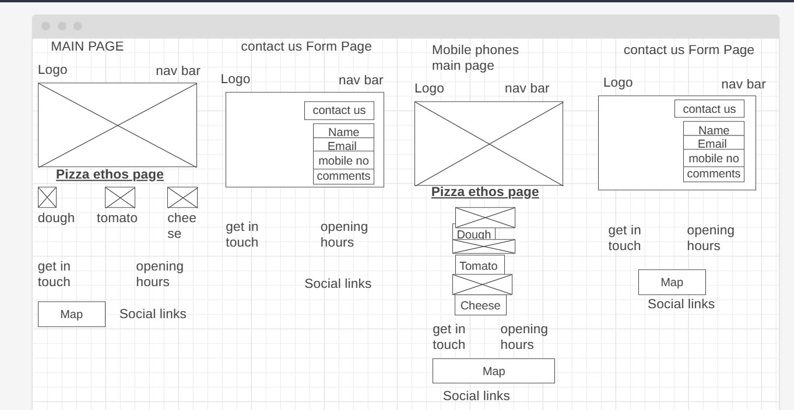
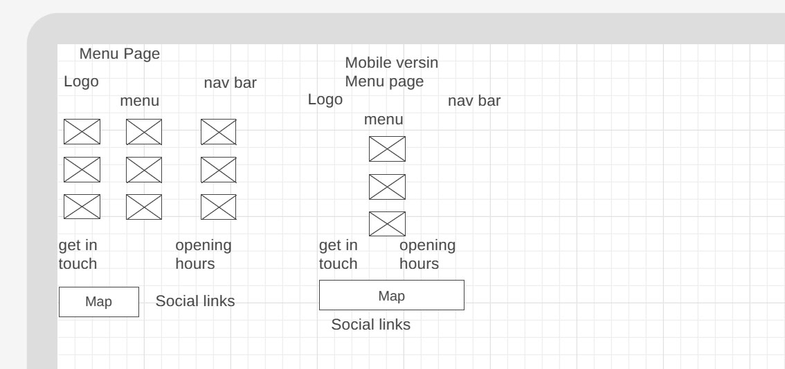

# Pizza House

Welcome to the [Pizza House](https://naisepaul.github.io/html-css-project/)! This Readme file provides an overview of our pizza shop and functionalities. Please read through this documents to familiarize everyone with shop's featues and guildlines.

This project is for educational purposes and can not be used as a template for a business use. Main aim is to build responsive website with HTML and CSS only.

## Table of Contents

- [UX (User Experience)](<#ux(user-experience)>)
  - [Website owner business goals](#website-owner-business-goals)
  - [User goals](#user-goals)
    - [New user goals](#new-user-goals)
    - [Returning user goals](#returning-user-goals)
  - [User Stories](#user-stories)
  - [Structure of the website](#structure-of-the-website)
  - [Wireframes](#wireframes)
  - [Surface](#surface)
- [Features](#feature)
- [Technology](#technology)
- [Testing](#testing)
  - [Functionality testing](#functionality-testing)
  - [Compatibility testing](#compatibility-testing)
  - [User stories testing](#user-stories-testing)
  - [Issues found during site development](#issues-found-during-site-development)
  - [Performance testing](#performance-testing)
- [Code Validation](#code-validation)
- [Deployment](#deployment)
- [Credits](#credits)
- [Screenshots](#screenshots)

# UX

## Website owner business goals

The main goals for this website is introduce new pizza brand to the market. Moreover increase sales,exploring new opportunities, etc.

## User goals

### New user goals :

- User can see our pizza ethos details
- User can see our pizza prices
- see our location

### Returning user goals:

- See the pizza price
- check our locations

## User stories

### As a business owner:

- I want to create more new online business.
- I would like to build and maintain relationship with new customers.

### As a customer

- I wish to find the pizza shop.
- I wish to order the pizza
- I can comment about the services, compliants, sugessions

## Structure of the website

The website is meticulously crafted to ensure a seamless and intuitive user experience across all types of devices. Whether accessed on a desktop computer, tablet, or mobile device, users can expect a phenomenal browsing experience with no discernible differences. Every element of the website is thoughtfully designed and optimized to deliver utmost user satisfaction and ensure that individuals can effortlessly navigate and interact with the site, regardless of the device they are using. The goal is to create a consistently outstanding user experience that transcends the boundaries of different devices.

## Wireframes

I used wireframe.cc to create wireframes

## Surface

### Colors

Colors used in this project

- background-color : #2e2727
- frontend color : #ffffff
- hover color : orange
- active color : red

### Fonts

- for headings I used Lobster and body Oswald

### Images

- I used www.freepik.com for downloding images.

# Features

- This website has 4 pages. It ia accessable form navigation bar from top.

## Navigation bar

#### Navigation bar is fixed on the top of the website.

It's servves as a s crucial element for user experience. We can access pages from navigation menu. It is responsive and will adopt to mobile and ipads for a hamburger menu.

- Navigation scheme
  - On the left side there is a logo. And it can be used as a navigation link to menu page.
  - On the right side there are 4 links or hamburger menu. It contains
    - Home
    - Menu
    - Our Ethos
    - Contact us

## Footer

It contains map on the left side and social media links on right side. And mobile it shows parallel.

## Home

- On top main image

- next is our pizza ethos section

- Address section with address and opening times

## Menu

- List of items available in different sizes

- Address section with address and opening times

## Contact Us

- It's one form to contact with shop comments and suggestions

[Back to Table of contents](#table-of-contents)

## Technology Used

### HTML 5

- As a structure language

### CSS

- As a style language

### Font Awesome

- As an icon library for social media links

### Google fonts

- As a font resource

### GitHub

- As a software hosting platform to keep project ina remote location

### Wireframe.cc

- As a wireframing tool

### Photoshop

- As an Image editor

[Back to Table of contents](#table-of-contents)

# Testing

## Functionality testing

I used Chrome developer tools and Microsoft Edge through out the project for testing and solving problems with responsiveness and style issues

## Compatibility testing

Website was tested multiple virtual mobile aand tablet devices and browser.

## User Stories testing

### As a business owner:

- I want to create more new online business.
  - With online site it is easy
- I would like to build and maintain relationship with new customers.
  - Customer are able to find alinks to social media at the end the page

### As a customer

- I wish to find the pizza shop address.
  - customers can see address and map on the site
- I wish to see the pizza menu
- I can comment about the services, compliants, sugessions

## Issues found during site development

#### Mobile screen compatability

I found many bugs when I use different size of mobile devices.

- Changing image size and font size of headings fixed the problems.

#### Horizontal scrolling bar on the bottom of the page

- Changing the map size and main image size controlled the problems.

## Performance testing

I run [Lighthouse](https://developers.google.com/web/tools/lighthouse/) tools to check performance of the website.
I made many change to improve performance.
