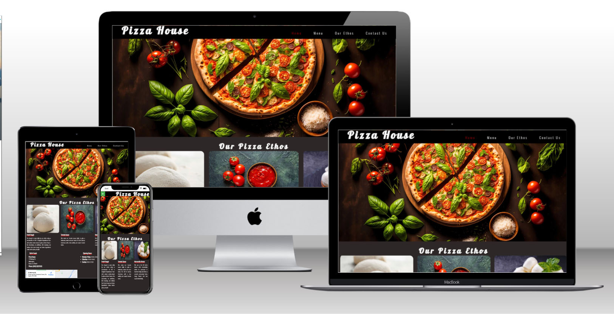

# Pizza House

Welcome to the [Pizza House](https://naisepaul.github.io/html-css-project/)! This Readme file provides an overview of our pizza shop and functionalities. Please read through this documents to familiarize everyone with shop's featues and guildlines.

This project is for educational purposes and can not be used as a template for a business use. Main aim is to build responsive website with HTML and CSS only.

## Table of Contents

- [UX (User Experience)](<#ux(user-experience)>)
  - [Website owner business goals](#website-owner-business-goals)
  - [User goals](#user-goals)
    - [New user goals](#new-user-goals)
    - [Returning user goals](#returning-user-goals)
  - [User Stories](#user-stories)
  - [Structure of the website](#structure-of-the-website)
  - [Wireframes](#wireframes)
  - [Surface](#surface)
- [Features](#feature)
- [Technology](#technology)
- [Testing](#testing)
  - [Functionality testing](#functionality-testing)
  - [Compatibility testing](#compatibility-testing)
  - [Code Validation](#code-validation)
  - [User stories testing](#user-stories-testing)
  - [Issues found during site development](#issues-found-during-site-development)
  - [Performance testing](#performance-testing)
- [Deployment](#deployment)
- [Credits](#credits)
- [Screenshots](#screenshots)

# UX

## Website owner business goals

The main goals for this website is introduce new pizza brand to the market. Moreover increase sales,exploring new opportunities, etc.

## User goals

### New user goals :

- User can see our pizza ethos details
- purchase our gift cards voucher for their loved ones
- see our locations

### Returning user goals:

- buy gift card vouchers for their loved ones.
- check our locations

## User stories

### As a business owner:

- I want to develop the website with more details like menu, online ordering,etc.
- I would like to build and maintain relationship with new customers.

### As a customer

- I wish to find the pizza shop.
- I wish to order the pizza

## Structure of the website

The website is meticulously crafted to ensure a seamless and intuitive user experience across all types of devices. Whether accessed on a desktop computer, tablet, or mobile device, users can expect a phenomenal browsing experience with no discernible differences. Every element of the website is thoughtfully designed and optimized to deliver utmost user satisfaction and ensure that individuals can effortlessly navigate and interact with the site, regardless of the device they are using. The goal is to create a consistently outstanding user experience that transcends the boundaries of different devices.

## Wireframes
